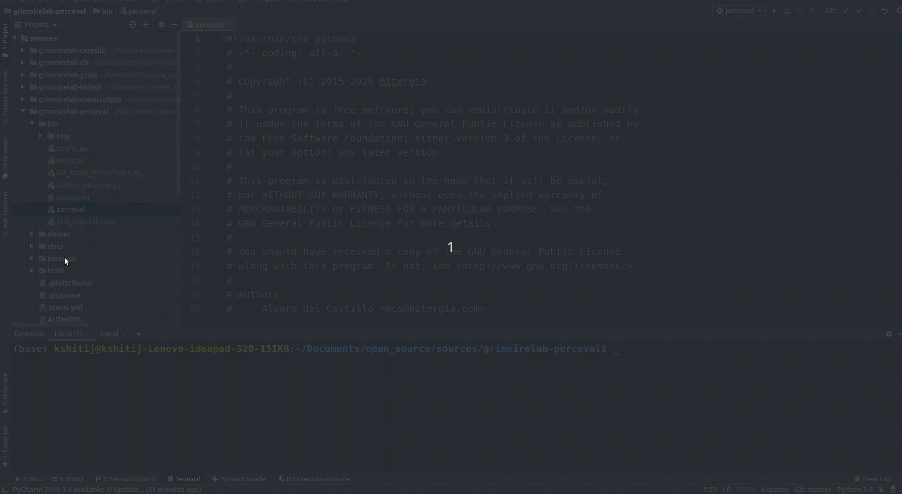

# Microtask 1:

## Task: Set up Perceval to be executed from PyCharm.

Solution:

After downloading and installing Pycharm in Microtask 0. Its time for setting up Perceval.

Step 1) Fork grimoirelab-perceval Repository.(Later helps when want to send Pull Request to orgranization) 

Step 2) Clone the repository and open it using Pycharm.

Step 3) Edit the Run/Debug configuration with the following configuration

Script path: as bin/perceval from the project Repositor.

Parameters: as the required perceval parameter

Apply the changes & Run the script.

## Demo:
I am using git backend and retriving data from repo https://github.com/kshitij3199/DSA_LAB from data 1/1/2020 to 10/3/2020

