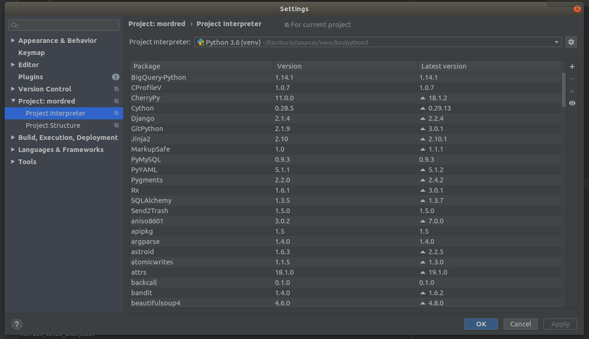
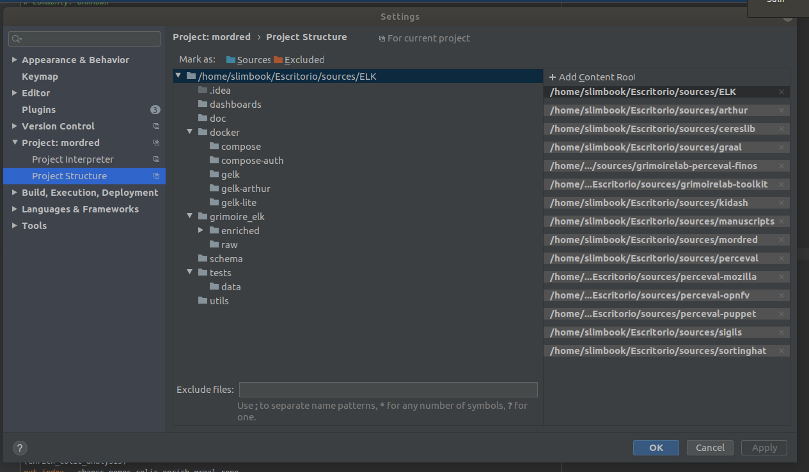

# Microtask4
# Set up a dev environment to work on GrimoireLab. 

Have a look to https://github.com/chaoss/grimoirelab-sirmordred#setting-up-a-pycharm-dev-environment.

Solution/Method

#### Step 1:-Fork the following [repos](https://github.com/chaoss/grimoirelab-sirmordred/blob/master/Getting-Started.md#source-code-) and cloning them to a target local folder (e.g.,```sources```).

Each local repo should have two ```remotes: origin``` points to the forked repo, while ```upstream``` points to the original CHAOSS repo. An example is provided below
```
~/sources/perceval$ git remote -v
origin	https://github.com/kshitij3199/perceval (fetch)
origin	https://github.com/kshitij/perceval (push)
upstream	https://github.com/chaoss/grimoirelab-perceval (fetch)
upstream	https://github.com/chaoss/grimoirelab-perceval (push)
```
In order to add a remote to a Git repository, you can use the following command:
```
~/sources/perceval$ git remote add upstream https://github.com/chaoss/grimoirelab-perceval
```

Step 2:-To install the dependencies, you can click on ```File -> Settings -> Project -> Project Interpreter```, and then the ```+``` located on the top right corner (see figure below).

Later, you can add the dependencies to the grimoirelab components via ```File -> Settings -> Project -> Project Structure```. The final results should be something similar to the image below.

#### Step 3 :- Create docker-compose.yml file as present [here](https://github.com/kshitij3199/GSoc_Chaoss_microTask/blob/master/Microtask4/docker-compose.yml)

#### Step 4 :- Run ```docker-compose up -d``` to get ElasticSearch, Kibiter and MariaDB.
